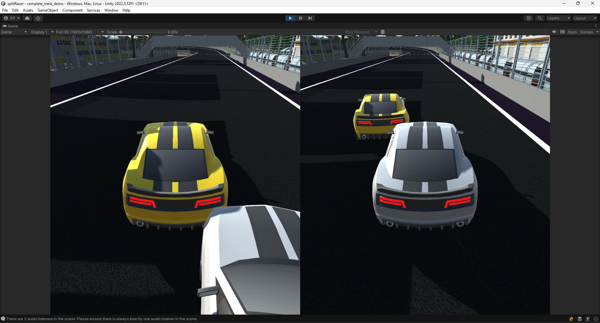
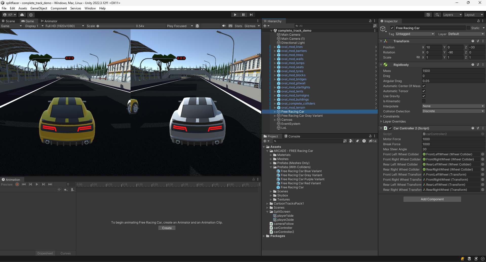
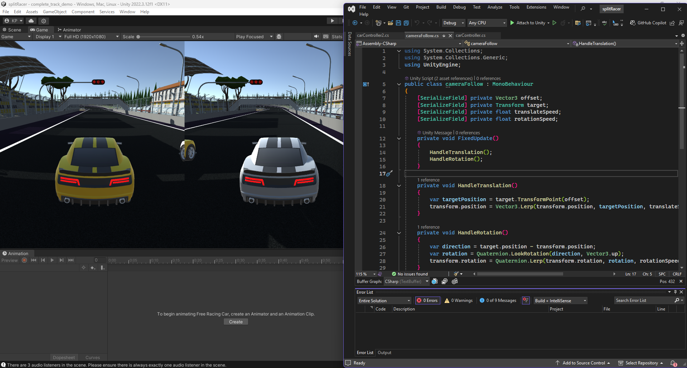

# Duel Drive

## Overview
**Duel Drive** is a **3D split-screen racing game** built in **Unity** that allows **two players** to race against each other on the same display. Players can use the **WASD keys, arrow keys, or a gamepad** to control their vehicles and compete for victory.

## Features
- **Split-screen gameplay**: Race head-to-head with a friend on the same PC.
- **Multiple control options**: Supports **keyboard (WASD/Arrow Keys) and gamepad**.
- **Immersive racing experience**: 3D environments and competitive mechanics.
- **Unity-powered physics and graphics**.

## Controls
| Player | Control Scheme |
|--------|---------------|
| Player 1 | WASD Keys / Gamepad |
| Player 2 | Arrow Keys / Gamepad |

## Development Details
- **Engine:** Unity
- **Programming Language:** C#
- **Game Type:** Local Multiplayer Racing

## Repository Contents
Due to the large file size of the full Unity project, only the **C# scripts** and a few **images** from the Unity engine and game are included in this repository.

### What's Included:
- C# scripts for game mechanics (car movement, collision handling, UI, etc.)
- Screenshots of the game and Unity environment

### What's Not Included:
- Full Unity project files (Assets, Scenes, Textures, Models, etc.)
- Build files or executables

## Screenshots

## Running the Code
If you'd like to explore the game's functionality:
1. Open **Unity** (compatible version used in development recommended).
2. Create a new **3D project**.
3. Copy the provided **C# scripts** into the **Assets/Scripts** folder.
4. Integrate the scripts with Unity objects accordingly.
5. Playtest using **split-screen mode** and multiple input methods.

## Future Improvements
- Adding AI-controlled racers for solo play.
- Implementing more maps and vehicle choices.
- Enhancing graphics and UI elements.
- Online multiplayer support (stretch goal).

## License
This project is released under the **MIT License**. Feel free to modify and expand on it!

## Contact
If you have any questions or want to contribute, feel free to reach out!

Happy Racing! 🏎️💨

